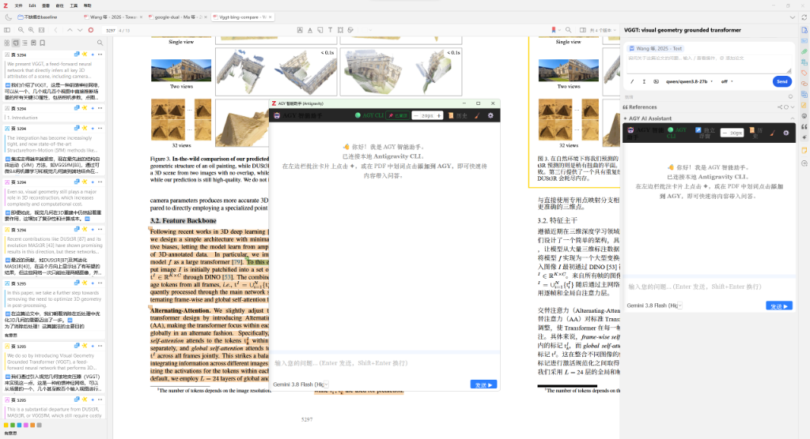
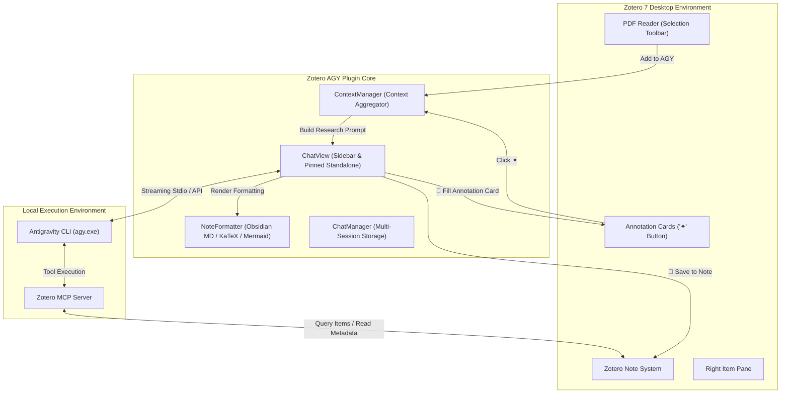

# Zotero AGY ✦

<p align="center">
  
</p>

<p align="center">
  <strong>Next-Generation AI Research Assistant for Zotero 7</strong><br/>
  Powered by Local <strong>Antigravity CLI (agy)</strong> · Dual-Mode UI (Sidebar & Pinned Standalone Window) · Obsidian-Style Typography · Bidirectional Annotation Card Sync · KaTeX & Mermaid Diagrams
</p>

<p align="center">
  <a href="https://github.com/Gty0709/ZoteroAGY/releases"></a>
  <a href="https://www.zotero.org/"></a>
  <a href="LICENSE"></a>
  
  
  
</p>

<p align="center">
  <a href="#-table-of-contents">English</a> | <a href="#-简体中文">简体中文</a>
</p>

---

## 📸 Preview

<p align="center">
  
</p>
<p align="center"><em>Zotero AGY in action: PDF reader with text selection, sidebar annotations with one-click injection (✦), pinned floating window, and rich responses.</em></p>

---

## 📖 Table of Contents

- [💡 Overview](#-overview)
- [✨ Key Features](#-key-features)
  - [1. Dual-Mode UI: Native Sidebar & Pinned Floating Window](#1-dual-mode-ui-native-sidebar--pinned-floating-window)
  - [2. PDF Highlights & Left Annotation Card Bidirectional Sync](#2-pdf-highlights--left-annotation-card-bidirectional-sync)
  - [3. Obsidian-Grade Academic Markdown & Typography](#3-obsidian-grade-academic-markdown--typography)
  - [4. Global Proportional Dynamic Font Zoom](#4-global-proportional-dynamic-font-zoom)
  - [5. Intelligent Multi-turn History Drawer](#5-intelligent-multi-turn-history-drawer)
  - [6. Native Antigravity CLI & MCP Tool Integration](#6-native-antigravity-cli--mcp-tool-integration)
- [🏗️ Architecture](#️-architecture)
- [📦 Installation](#-installation)
- [🚀 Quick Start](#-quick-start)
- [⚙️ Configuration](#️-configuration)
- [💻 Development & Build](#-development--build)
- [👤 Author & Contributions](#-author--contributions)
- [📄 License](#-license)
- [🇨🇳 简体中文](#-简体中文)

---

## 💡 Overview

Many existing Zotero AI plugins rely on fragile browser reverse-engineering or cumbersome third-party API Keys with strict rate limits and plain text formatting.

**Zotero AGY** reimagines the academic paper reading and research workflow:

- ⚡ **Zero API Key Friction**: Communicates natively with your local **Antigravity CLI (`agy`)**, unlocking cutting-edge models (Gemini 2.5 Pro / Flash, Claude 3.7 Sonnet, etc.) with real-time streaming output.
- 📖 **Embedded in Your Reading Flow**: Add PDF selections or annotation cards into context with one click, and inject AI analysis directly back into your annotation comments.
- 🎨 **Publication-Quality Formatting**: Anthropic Serif / Copernicus for English, STZhongsong (华文中宋) for Chinese, complete Obsidian Callout boxes, LaTeX formulas, and Mermaid vector diagrams.
- 🖥️ **Always-on-Top Floating Window**: Pop out into an independent window with pinned mode (`📌`) for multi-monitor setups without overlapping your papers.

---

## ✨ Key Features

### 1. Dual-Mode UI: Native Sidebar & Pinned Floating Window

- **Native Sidebar Mode**: Integrated cleanly into Zotero 7's right-hand item pane, automatically respecting system light and dark themes.
- **Detached Pinned Window**: Click `↗️ Standalone` to pop out the assistant into an independent window:
  - Drag and resize freely across screens;
  - Toggle `📌 Pinned` to keep the chat interface on top of your PDF reading workspace.

### 2. PDF Highlights & Left Annotation Card Bidirectional Sync

- **PDF Selection into Context**: Highlight or select text in any PDF reader tab; the floating menu offers **"Add to AGY"** with page number and excerpt preserved.
- **Annotation Card 1-Click Injection**: Every card in the left annotation sidebar features a dedicated **`✦`** button to inject excerpts into the conversation.
- **AI Feedback Auto-Fill**: Under each AI response, click **"💬 Fill Annotation Card"** to automatically populate the annotation's comment with the generated analysis, definitions, or critique!
- **1-Click Zotero Note Archive**: Click **"📝 Save to Note"** to archive the structured Q&A and reference metadata as a rich HTML child note under the selected bibliographic item.

### 3. Obsidian-Grade Academic Markdown & Typography

- **Academic Fonts**: English rendered in _Anthropic Serif / Copernicus_, Chinese in _华文中宋 (STZhongsong)_, code in monospace.
- **Obsidian Callouts**: Full support for `> [!note]`, `> [!tip]`, `> [!warning]`, `> [!important]`, `> [!caution]`, and `> [!bug]`.
- **KaTeX Math Rendering**: Inline math (`$E=mc^2$`) and display math (`$$\int_{-\infty}^{\infty} e^{-x^2} dx = \sqrt{\pi}$$`) rendered with KaTeX.
- **Mermaid Vector Flowcharts & Diagrams**: Built-in Mermaid v10 vector graphics engine with syntax pass-through, robust error recovery, and collapsible source view.
- **Obsidian Code Blocks**: Language badges, highlighted code areas, and a 1-click copy button.

### 4. Global Proportional Dynamic Font Zoom

- Top-bar zoom controls (`－`, `14px`, `＋`) supporting **12px to 28px**.
- Proportional scaling applied globally: chat bubbles, headers, dropdowns, code blocks, Callout boxes, tables, and math equations all scale together.

### 5. Intelligent Multi-turn History Drawer

- Click **"📜 History"** to slide open the session drawer.
- Automatic semantic topic summarization for each conversation.
- Quick session switching, relative timestamps, message count, and single-click deletion.

### 6. Native Antigravity CLI & MCP Tool Integration

- **CLI Health Indicator**: Real-time `🟢 AGY CLI` status badge in the header.
- **Agent Capabilities**: Built-in instructions for web research (`search_web`, `read_url_content`) and local Zotero MCP (`zotero-mcp`) tools.
- **Model Switcher**: Switch active models on the fly via the footer dropdown.

---

## 🏗️ Architecture



---

## 📦 Installation

### Method 1: Download from Releases (Recommended)

1. Download the latest `zotero-agy.xpi` from the [GitHub Releases](https://github.com/Gty0709/ZoteroAGY/releases).
2. Open **Zotero 7**.
3. Go to **Tools** -> **Plugins** (or **Add-ons**).
4. Click the gear icon ⚙️ in the upper-right corner and select **Install Add-on From File...**.
5. Select the downloaded `zotero-agy.xpi` file and confirm installation.
6. Restart Zotero when prompted.

---

## 🚀 Quick Start

1. **Verify Antigravity CLI**:
   - Ensure `agy` is installed and available in your terminal (`agy --version`).
   - Open Zotero 7 and expand the AGY panel on the right. A green `🟢 AGY CLI` badge indicates ready status.
   - _(If `🔴 CLI Not Found` appears, open Settings -> ZoteroAGY and click **"🔍 自动寻找"** to auto-detect, or **"📁 手动选择"** to pick your binary)._

2. **Start Researching**:
   - Open any PDF article. Highlight key arguments or formulas and click **"Add to AGY"**.
   - Type your research query (e.g., _"Critique the authors' core assumptions based on the selected passage"_), then press Enter.

3. **Enrich Your Annotations**:
   - Click **"💬 Fill Annotation Card"** beneath the AI answer to automatically paste the analysis into the highlighted card's comment section.
   - Click **"📝 Save to Note"** to archive the response into a structured Zotero child note.

---

## ⚙️ Configuration

Open Zotero Preferences: **Edit** -> **Preferences** -> **ZoteroAGY**:

| Setting                  | Default                           | Description                                                            |
| :----------------------- | :-------------------------------- | :--------------------------------------------------------------------- |
| **Antigravity CLI Path** | Auto-detected (`agy` / `agy.exe`) | Supports 1-click **Auto-Detect**, native **File Picker**, and **Test** |
| **Default Model**        | `gemini-3.8-flash-high`           | Select between Gemini 3.8, Gemini 3.1 Pro, Claude, etc.                |
| **Always on Top**        | Enabled (`true`)                  | Whether standalone floating window stays on top                        |
| **Default Font Size**    | `14px`                            | Base font size (12px ~ 28px)                                           |

- 🐧 **Linux Native Support**: Fully adapted for Linux desktop environments (auto-detects `~/.local/bin/agy`, `~/.gemini/antigravity/bin/agy`, `/usr/local/bin/agy`, Flatpak/Snap, with shell PATH fallbacks).
- 🔍 **Auto-Detect (自动寻找)**: Automatically scans system paths and common installation locations for the CLI.
- 📁 **Manual Select (手动选择)**: Opens native OS file dialog (`nsIFilePicker`) to select the executable.
- ⚡ **Test Connection (测试连接)**: Verifies CLI execution and displays detected version badge.

---

## 💻 Development & Build

### Prerequisites

- Node.js >= 18.0.0
- npm >= 9.0.0

### Build Commands

```bash
# Clone the repository
git clone https://github.com/Gty0709/ZoteroAGY.git
cd ZoteroAGY

# Install dependencies
npm install

# Run code style & lint checks
npm run lint:check

# Build the production .xpi package
npm run build
```

The compiled extension package is generated at:
`.scaffold/build/zotero-agy.xpi`

---

## 👤 Author & Contributions

- **Author & Maintainer**: **Gty0709** ([@Gty0709](https://github.com/Gty0709))
- **Template Acknowledgement**: Initial plugin scaffolding based on the public template [windingwind/zotero-plugin-template](https://github.com/windingwind/zotero-plugin-template).
- All AI chat architecture, Antigravity CLI integration, Obsidian typography engine, and bidirectional annotation features are solely authored and maintained by **Gty0709**.

---

## 📄 License

This project is licensed under the [GNU Affero General Public License v3.0 or later (AGPL-3.0-or-later)](LICENSE).

---

# 🇨🇳 简体中文

## 项目简介

**Zotero AGY** 是专为 **Zotero 7** 打造的深度学术研究与文献精读 AI 插件。

- ⚡ **无 API Key 限制**：由本地 **Antigravity CLI (`agy`)** 原生驱动，畅享前沿模型生态（Gemini 3.8 / 3.1 Pro、Claude Sonnet/Opus 等），打字机极速流式响应。
- 🐧 **Linux 本机原生适配**：深度适配 Linux 桌面环境与环境变量，全面覆盖 `~/.local/bin/agy`、`~/.gemini/antigravity/bin/agy`、`/usr/local/bin` 等目录与 shell 回退检测。
- 🛠️ **全能首选项配置**：支持「🔍 自动寻找」一键探测 CLI、支持原生「📁 手动选择」文件选择器，并提供实时「⚡ 测试连接」与版本状态显示。
- 📑 **PDF 划词与批注卡片双向联动**：阅读器划选一键带入上下文、左侧高亮批注卡片「`✦`」快速引用、AI 解答一键「💬 填入批注卡片」反哺评论区。
- 🎨 **Obsidian 级学术排版**：英文字体 Anthropic Serif，中文字体华文中宋，支持 Obsidian Callouts 彩色提示框、KaTeX 公式与 Mermaid 矢量流程图。
- 🖥️ **屏幕独立置顶浮窗**：窗口自由拖拽与缩放，支持「📌 已置顶」在屏幕最前端，文献阅读与 AI 对话互不遮挡。
- 🔍 **动态字号等比缩放**：支持 12px ~ 28px 自由调节，消息气泡、界面按钮、代码块、提示框全要素等比缩放。
- 📜 **多轮历史会话管理**：内置侧边抽屉式历史记录，智能提炼会话名称，支持多会话无缝切换与清理。

### 安装与使用

1. 在 [Releases 页面](https://github.com/Gty0709/ZoteroAGY/releases) 下载 `zotero-agy.xpi`；
2. 打开 Zotero 7 -> 工具 -> 插件 -> 齿轮图标 -> `Install Add-on From File...`；
3. 选择下载好的 `.xpi` 文件安装并重启 Zotero；
4. 进入 **设置 -> ZoteroAGY**，可直接点击「🔍 自动寻找」一键识别本地 CLI 并测试连接！
