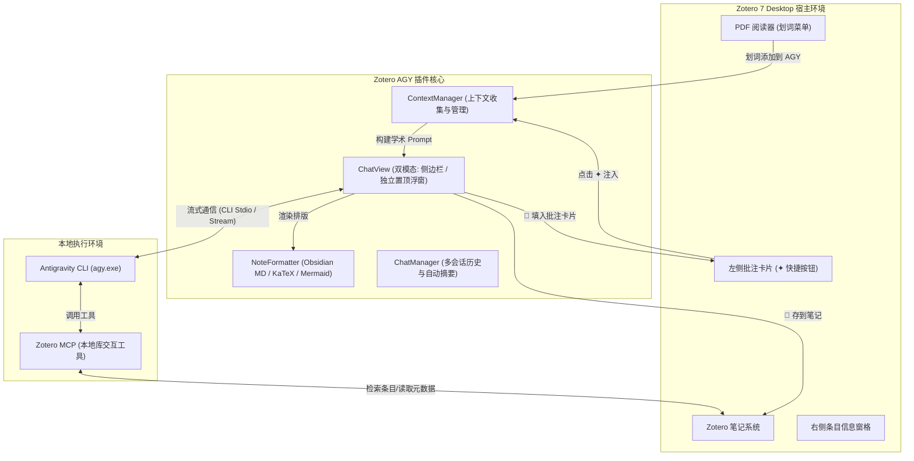

# Zotero AGY ✦

<p align="center">
  
</p>

<p align="center">
  <strong>专为学术研究打造的现代化 Zotero 7 AI 助手</strong><br/>
  由本地 <strong>Antigravity CLI (agy)</strong> 原生驱动 · 支持侧边栏与独立置顶浮窗 · Obsidian 风格排版 · 批注卡片双向联动 · LaTeX 公式与 Mermaid 流程图
</p>

<p align="center">
  <a href="https://github.com/Gty0709/ZoteroAGY/releases"></a>
  <a href="https://www.zotero.org/"></a>
  <a href="https://github.com/Gty0709/ZoteroAGY/blob/main/LICENSE"></a>
  
  
</p>

---

## 📖 目录

- [💡 为什么选择 Zotero AGY？](#-为什么选择-zotero-agy)
- [✨ 核心特性](#-核心特性)
  - [1. 灵活的双形态交互界面](#1-灵活的双形态交互界面)
  - [2. PDF 划词与左侧批注卡片深度联动](#2-pdf-划词与左侧批注卡片深度联动)
  - [3. Obsidian 级学术 Markdown 渲染与排版](#3-obsidian-级学术-markdown-渲染与排版)
  - [4. 全界面动态等比字号缩放系统](#4-全界面动态等比字号缩放系统)
  - [5. 智能历史会话管理抽屉](#5-智能历史会话管理抽屉)
  - [6. 原生 Antigravity CLI 与 MCP 生态连接](#6-原生-antigravity-cli-与-mcp-生态连接)
- [🏗️ 系统架构图](#️-系统架构图)
- [📦 安装指南](#-安装指南)
- [🚀 快速上手](#-快速上手)
- [⚙️ 首选项与配置](#️-首选项与配置)
- [💻 本地编译与开发](#-本地编译与开发)
- [📄 开源协议](#-开源协议)

---

## 💡 为什么选择 Zotero AGY？

很多现有的 Zotero AI 扩展依赖繁琐的第三方 API Key 配置或不稳定的网页逆向协议，排版简陋，无法与阅读器批注深度交互。

**Zotero AGY** 彻底重构了文献精读与 AI 协作的体验：
- ⚡ **无 API 烦恼**：直接连接你本地运行的 **Antigravity CLI (`agy`)**，畅享前沿顶尖大模型（如 Gemini 2.5 Pro / Flash、Claude 3.7 Sonnet 等），响应飞快。
- 📖 **深度嵌入阅读流**：支持划词自动引用、左侧批注卡片一键带入、AI 解答一键反哺写入卡片评论。
- 🎨 **学术出版级排版**：英文字体 Anthropic Serif，中文字体华文中宋，支持 Obsidian Callouts 彩色提示框、KaTeX 公式与 Mermaid 可视化矢量流程图。
- 🖥️ **屏幕独立置顶浮窗**：窗口自由拖拽、多屏漫游，支持屏幕最前端置顶，读文献绝不互相遮挡。

---

## ✨ 核心特性

### 1. 灵活的双形态交互界面
- **原生侧边栏模式**：无缝融入 Zotero 7 右侧条目信息窗格，自动适配 Zotero 原生浅色与深色主题。
- **独立置顶浮动窗口**：点击顶栏 `↗️ 独立浮窗`，即可将问答界面弹出为独立窗口：
  - 自由拖拽位置与缩放窗口大小，适合双屏/宽屏学术研读；
  - 提供 `📌 已置顶` 按钮，开启后窗口始终悬浮在屏幕最前端，边看 PDF 边提问。

### 2. PDF 划词与左侧批注卡片深度联动
- **PDF 划选即问**：在 Zotero PDF 阅读器中高亮或选中任意文字，浮动菜单即刻出现「**添加到 AGY**」，自动提取文本与所在页码。
- **左侧批注卡片快捷带入**：阅读器左侧边栏高亮卡片右上角均嵌入专属「**✦**」按钮，单点即可将该卡片的划线与评论带入问答上下文。
- **AI 解答自动反哺填入卡片**：AI 回答气泡下方提供「**💬 填入批注卡片**」按钮，能将 AI 对该段落的深度解读、术语释义或批判性见解一键自动填充进对应卡片的笔记/评论栏！
- **一键存入 Zotero 笔记**：点击「**📝 存到笔记**」，自动生成带有上下文引用和时间戳的精美结构化笔记，归档至对应文献。

### 3. Obsidian 级学术 Markdown 渲染与排版
- **精美学术字体**：英文采用 *Anthropic Serif / Copernicus / Tiempos Text*，中文采用优雅的**华文中宋**，代码块使用经典等宽字体。
- **Obsidian Callouts 提示框**：完整支持 `> [!note]`, `> [!tip]`, `> [!warning]`, `> [!important]`, `> [!caution]`, `> [!bug]` 等彩色高亮提示卡片。
- **KaTeX 数学公式渲染**：行内公式 `$E=mc^2$` 与块级公式 `$$\int_{-\infty}^{\infty} e^{-x^2} dx = \sqrt{\pi}$$` 原生优雅排版。
- **Mermaid 矢量流程图与架构图**：
  - 内置 Mermaid v10 矢量渲染引擎；
  - 针对 Gecko XHTML 与复杂的学术数学符号节点做了专门的容错直通与渲染保护；
  - 提供「源码」切换展开与「📋 复制」按钮。
- **代码块顶栏**：带有专属暗色顶栏，清晰标明编程语言名称（如 `PYTHON`, `TYPESCRIPT`），并附带一键复制代码按钮。

### 4. 全界面动态等比字号缩放系统
- 顶部集成字号调节器（`－`、当前字号如 `14px`、`＋`），支持从 **12px 至 28px** 自由缩放。
- **全局等比放大**：不仅放大聊天文字，界面的标题、操作按钮、模型下拉选择框、历史侧边栏抽屉、代码块顶栏、彩色 Callout 框、表格及公式全要素同步等比放大，彻底解决字体过小阅读费眼的问题。

### 5. 智能历史会话管理抽屉
- 点击顶栏「**📜 历史**」，侧向滑出抽屉式历史会话列表。
- **自动智能摘要标题**：根据首轮问答语义自动提炼会话名称（如“流体动力学纳维-斯托克斯方程解析”）。
- 支持查看相对时间与消息数、历史会话快速切换与一键清理删除。

### 6. 原生 Antigravity CLI 与 MCP 生态连接
- **实时 CLI 状态感知**：顶栏指示灯实时检测本地 `🟢 AGY CLI` 是否就绪，点击即可测试连通性。
- **学术工具链集成**：自动携带联网搜索指令与本地 `zotero-mcp` 插件通信能力，支持跨文献题录检索与全文挖掘。
- **多模型即时切换**：输入栏下方下拉菜单支持快捷切换可用模型底座。

---

## 🏗️ 系统架构图



---

## 📦 安装指南

### 方法一：从 Releases 下载安装（推荐）

1. 在 GitHub 的 [Releases 页面](https://github.com/Gty0709/ZoteroAGY/releases) 下载最新版本的 `zotero-agy.xpi` 文件。
2. 打开 **Zotero 7**。
3. 点击顶部菜单栏的 **工具 (Tools)** -> **插件 (Plugins / Add-ons)**。
4. 点击插件管理窗口右上角的齿轮 ⚙️ 图标，选择 **Install Add-on From File...** (从文件安装扩展)。
5. 选择下载好的 `zotero-agy.xpi`，确认安装。
6. 重启 Zotero 即可完成安装！

---

## 🚀 快速上手

1. **确认 Antigravity CLI 已就绪**：
   - 确保您的系统已安装 `agy` 并在命令行可用（在终端执行 `agy --version` 可正常输出）。
   - 打开 Zotero 7，右侧展开 AGY 助手，若顶栏显示 `🟢 AGY CLI` 即表示连接成功！
   - *（如显示 🔴 未检测到 agy，点击该按钮在首选项中手动指定 `agy.exe` 绝对路径即可）*。

2. **开启文献精读对话**：
   - 在主界面右侧点击机器人图标展开「AGY 智能助手」；或点击顶栏 `↗️ 独立浮窗` 打开置顶悬浮窗。
   - 打开任意 PDF 文献，划选核心论点，在弹出菜单中点击「**添加到 AGY**」。
   - 输入您的问题（例如：“请结合上述选中文段，深入剖析作者的核心假设及其局限性”），按回车发送。

3. **利用 AI 丰富您的学术笔记**：
   - **反哺批注**：点击回答下方的「**💬 填入批注卡片**」，该回答会自动写入刚才划词高亮卡片的笔记评论区。
   - **归档文献笔记**：点击「**📝 存到笔记**」，回答将自动保存至该文献的独立子笔记中。

---

## ⚙️ 首选项与配置

进入 Zotero 菜单栏 **编辑 (Edit)** -> **首选项 (Preferences)** -> **ZoteroAGY**：

| 配置项 | 默认值 | 说明 |
| :--- | :--- | :--- |
| **Antigravity CLI 路径** | 自动探测 (`agy` / `agy.exe`) | 若未加入系统 PATH，可手动浏览指定 `agy.exe` 路径 |
| **默认首选模型** | `gemini-2.5-flash` | 可选择 `gemini-2.5-flash`、`gemini-2.5-pro` 等 |
| **浮窗默认屏幕置顶** | 开启 (`true`) | 独立浮窗打开时是否默认保持在系统最前端 |
| **默认界面字号** | `14px` | 支持 12px ~ 28px 自由调节 |

---

## 💻 本地编译与开发

如果您希望自行编译或进行功能定制：

### 环境需求
- Node.js >= 18.0.0
- npm >= 9.0.0

### 开发步骤

```bash
# 1. 克隆代码仓库
git clone https://github.com/Gty0709/ZoteroAGY.git
cd ZoteroAGY

# 2. 安装依赖
npm install

# 3. 编译打包生成 XPI
npm run build
```

编译生成好的插件安装包位于：
`.scaffold/build/zotero-agy.xpi`

---

## 📄 开源协议

本项目基于 [AGPL-3.0 License](LICENSE) 开源发布。
欢迎提交 Issue 与 Pull Request 共同完善！
